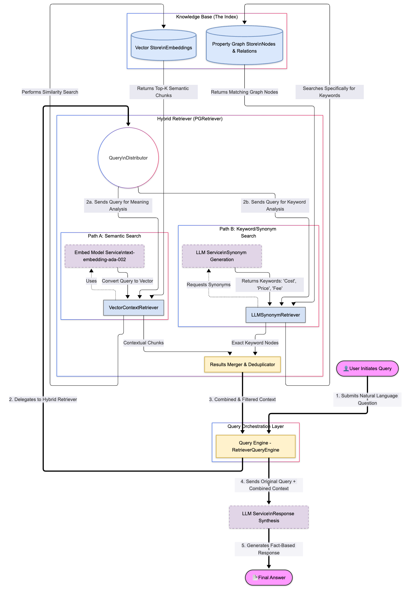

<div align="center">

# 🔍 Hybrid Search RAG

**Advanced Retrieval Augmented Generation with Property Graph Index**

[](https://www.python.org/downloads/)
[](https://www.llamaindex.ai/)
[](https://opensource.org/licenses/MIT)

[Features](#-features) • [Installation](#-installation) • [Quick Start](#-quick-start) • [Documentation](#-documentation)

</div>

---

## 📖 Table of Contents

- [Overview](#-overview)
- [Key Concepts](#-key-concepts)
- [Features](#-features)
- [Installation](#-installation)
- [Quick Start](#-quick-start)
- [Configuration](#-configuration)
- [Usage](#-usage)
- [Customization](#-customization)
- [Troubleshooting](#-troubleshooting)
- [Project Structure](#-project-structure)
- [Contributing](#-contributing)
- [License](#-license)

---

## 🌟 Overview

This project implements a **sophisticated RAG system** that combines multiple retrieval strategies:
- 🎯 **Vector Similarity Search** - Semantic understanding through embeddings
- 🔄 **LLM-Based Synonym Expansion** - Query enhancement for better coverage
- 🕸️ **Graph Traversal** - Relationship-aware context retrieval

Unlike traditional vector-only RAG, this hybrid approach provides **higher accuracy** and **better context diversity** for complex queries.

---

## 💡 Key Concepts

### Property Graph Index

Transform documents into a knowledge graph:

<div align="center">


</div>

### Hybrid Search Architecture

<div align="center">



</div>

**Three Retrieval Strategies:**

| Strategy | How It Works | Example |
|----------|-------------|---------|
| **Vector Search** | Semantic similarity via embeddings | "automobile" matches "car" |
| **Synonym Expansion** | LLM generates related terms | "CEO" → ["chief executive", "president"] |
| **Graph Traversal** | Follows entity relationships | "Carl Zeiss" → "Germany" → "Europe" |

---

## ✨ Features

- 📊 **Property Graph Indexing** - Automatic entity and relationship extraction
- 🔍 **Hybrid Retrieval** - Combines 3 complementary search strategies  
- 📝 **Tutorial Code** - 500+ lines of educational comments
- ⚙️ **Flexible Config** - Easy parameter tuning
- 🛡️ **Error Handling** - Robust exception management
- 💬 **Interactive Mode** - CLI for real-time querying

---

## 🚀 Installation

### Prerequisites

- Python 3.8 or higher
- OpenAI-compatible LLM server access

### Install Dependencies

```bash
pip install llama-index
pip install llama-index-llms-openai-like
pip install llama-index-embeddings-openai
pip install nest-asyncio
```

Or use requirements file:

```bash
pip install -r requirements.txt
```

---

## ⚡ Quick Start

### 1. Prepare Your Documents

```bash
mkdir -p ./data
cp your_documents.txt ./data/
```

Supported formats: `.txt`, `.pdf`, `.docx` (with appropriate loaders)

### 2. Configure API Settings

Edit `hybrid_search_rag.py`:

```python
CUSTOM_API_KEY = "your-api-key-here"
CUSTOM_API_BASE = "Your API Base"
LLM_MODEL = "gpt-4.1"
EMBED_MODEL = "text-embedding-ada-002"
```

### 3. Run the Script

```bash
python hybrid_search_rag.py
```

**Output:**
```
🔗 Connecting to custom server...
📚 Loading documents...
✅ Loaded 19 document(s)
🔨 Building Property Graph Index...
✨ PropertyGraphIndex built successfully!
🔍 Building Hybrid Retrievers...
⚙️  Building Query Engine...
💬 Query: What is the customer name...
🤖 Answer: The customer name is Microsoft Inc.
```

---

## 🔧 Configuration

### Core Parameters

| Parameter | Default | Description |
|-----------|---------|-------------|
| `similarity_top_k` | 3 | Number of similar chunks to retrieve |
| `max_keywords` | 5 | Synonym variations to generate |
| `temperature` | 0 | Response creativity (0-1) |
| `context_window` | 8192 | Max tokens model can process |
| `max_tokens` | 2048 | Max tokens in response |

### Example Configuration

```python
# High-recall configuration
vector_retriever = VectorContextRetriever(
    similarity_top_k=5,  # More context chunks
    include_text=True
)

# More query variations
synonym_retriever = LLMSynonymRetriever(
    max_keywords=10,  # More synonyms
    include_text=True
)
```

---

## 📚 Usage

### Basic Usage

```python
from hybrid_search_rag import main

# Run the complete pipeline
query_engine = main()
```

### Custom Queries

```python
from hybrid_search_rag import execute_query

# Ask specific questions
execute_query(query_engine, "What are the key requirements?")
execute_query(query_engine, "List all stakeholders")
```

### Interactive Mode

Uncomment the interactive loop in the script:

```python
while True:
    user_query = input("Your question: ").strip()
    if user_query.lower() in ['exit', 'quit']:
        break
    execute_query(query_engine, user_query)
```

---

## 🎨 Customization

### Add Custom Retrievers

```python
from llama_index.core.indices.property_graph import TextToCypherRetriever

# Graph query retriever
cypher_retriever = TextToCypherRetriever(
    graph_store=index.property_graph_store,
    llm=Settings.llm
)

# Combine all retrievers
pg_retriever = PGRetriever(
    sub_retrievers=[
        vector_retriever,
        synonym_retriever,
        cypher_retriever  # Add custom retriever
    ]
)
```

### Performance Tuning

```python
# Faster indexing
index = PropertyGraphIndex.from_documents(
    documents,
    use_async=True,  # Async processing
    show_progress=True
)

# Persistent storage (avoid rebuilding)
index.storage_context.persist(persist_dir="./storage")
```

---

## 🐛 Troubleshooting

<details>
<summary><b>Model not found error</b></summary>

**Solution:** Verify your API configuration
```python
CUSTOM_API_BASE = "https://correct-server.com/v1"
LLM_MODEL = "correct-model-name"
```
</details>

<details>
<summary><b>Slow indexing performance</b></summary>

**Solution:** Enable progress tracking and async processing
```python
index = PropertyGraphIndex.from_documents(
    documents,
    use_async=True,
    show_progress=True
)
```
</details>

<details>
<summary><b>Poor answer quality</b></summary>

**Solution:** Increase retrieval parameters
```python
similarity_top_k=5      # More context
max_keywords=10         # More query variations
```
</details>

<details>
<summary><b>Out of memory errors</b></summary>

**Solution:** Reduce context window or batch process
```python
context_window=4096     # Smaller window
# Process documents in batches
```
</details>

---

## 📁 Project Structure

```
hybrid-search-rag/
├── hybrid_search_rag.py    # Main implementation (500+ lines)
├── data/                   # Document directory
│   ├── document1.txt
│   └── document2.txt
├── README.md              # This file
└── requirements.txt       # Python dependencies
```

---

## 🤝 Contributing

Contributions are welcome! Here's how you can help:

1. 🍴 Fork the repository
2. 🌱 Create a feature branch (`git checkout -b feature/amazing-feature`)
3. 💾 Commit your changes (`git commit -m 'Add amazing feature'`)
4. 📤 Push to the branch (`git push origin feature/amazing-feature`)
5. 🔀 Open a Pull Request

### Areas for Contribution
- 📖 Documentation improvements
- 🐛 Bug fixes and testing
- ✨ New retriever implementations
- 🎯 Performance optimizations

---

## 📜 License

This project is licensed under the **MIT License** - see the [LICENSE](LICENSE) file for details.

---

## 🙏 Acknowledgments

Built with amazing open-source tools:

- [**LlamaIndex**](https://www.llamaindex.ai/) - LLM application framework
- [**OpenAI**](https://openai.com/) - Embedding and language models
- **Property Graph** concepts from graph database research

---

## 📚 Resources

- 📖 [LlamaIndex Documentation](https://docs.llamaindex.ai)
- 🌐 [Property Graphs Explained](https://en.wikipedia.org/wiki/Graph_database)
- 🔢 [Vector Embeddings Guide](https://platform.openai.com/docs/guides/embeddings)
- 📄 [RAG Research Paper](https://arxiv.org/abs/2005.11401)

---

## 📞 Support

- 🐛 **Bug Reports:** [Open an issue](https://github.com/yourusername/hybrid-search-rag/issues)
- 💬 **Questions:** [Start a discussion](https://github.com/yourusername/hybrid-search-rag/discussions)
- 📧 **Email:** your.email@example.com

---

<div align="center">

**⭐ Star this repo if you find it helpful!**

Made with ❤️ by developers, for developers

</div>
